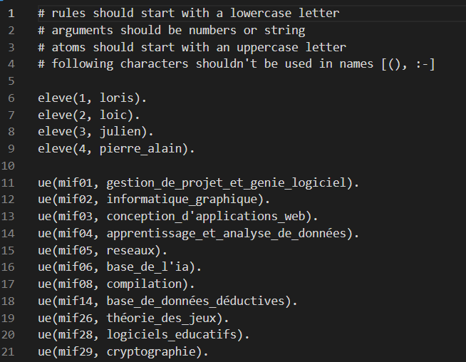

# Moteur d'inférence Datalog
## Introduction
Ce projet a pour objectif de réimplémenter un moteur d'inférence DATALOG (Sous-ensemble du langage Prolog) en y ajoutant le traitement des fonctions d'agréagation telles que **COUNT, AVG, SUM**, etc...

Pour ce faire, nous avons utilisé le langage Python et avons implémenté un parser permettant de transformer une requête DATALOG en dictionnaire de prédicat. Ce dictionnaire est ensuite parcouru dans notre phase d'évaluation afin d'obtenir le résultat attendu.

La description complète du projet est disponible dans le fichier [Rapport de projet](Rapport_de_projet_-_CHASSIN_MERCIER.pdf).



### Caractéristiques
Langage : python   
Année : 2023  
Tag : parser, datalog, prolog, aggregation, query, engine

## Table des matières
1. [Arborescence du projet](#1---arborescence-du-projet)
2. [Lancement de l'application](#lancement)
3. [Créer un fichier de requête](#parsing)
4. [Evaluation d'un programme](#evaluation)

## 1-- Arborescence du projet

- **main.py**      : Application principale permettant l'évaluation d'un programme DATALOG.
- **master.txt**  : Exemple complet d'un programme DATALOG (utilisé par défaut).
- **masterRESULTATS.txt** : Fichier résultat du programme master.txt.
- **operateurs.txt**: Exemple de programme utilisant le sopérateurs numériques
- **operateursRESULTATS.txt** : Fichier résultat du programme operateurs.txt.
- **Rapport_de_projet_-_CHASSIN_MERCIER.pdf** : Rapport de projet. 

<div id='lancement'>

## 2-- Lancement de l'application
Pour lancer l'application, il suffit de lancer la commande suivante :
```bash	
py main.py [FILENAME_IN] [FILENAME_OUT]
```
>_FILENAME_IN (facultatif)_ : correspond au fichier contenant la requête DATALOG à évaluer.  
>_FILENAME_OUT.txt (facultatif)_ : correspond au fichier de sortie contenant le résultat de la requête.

Si aucun fichier n'est spécifié, le programme utilisera les fichiers par défauts :
- master.txt en entrée
- out.txt en sortie


<div id='parsing'>

## 3-- Créer un fichier de requête
Ouvrez un fichier texte puis écrivez dans celui-ci votre programme DATALOG.  
Un programme se constitue :
- De faits (IDB)
- De règles (EDB)

Le fichier [master.txt](master.txt) contient un exemple de programme DATALOG.

Pour faciliter notre parseur, merci de respecter le format suivant : 
- Une ligne d’un programme est soit un commentaire, soit un EDB, soit un IDB. 
- Un commentaire doit débuter par un ‘#’ suivi d’un espace. 
- Les EDB et IDB doivent démarrer avec une lettre minuscule et finir par un point. 
- Deux EDB du même nom doivent posséder un nombre d’argument identique. 
- Un IDB est caractérisé par la présence du symbole ‘ :-‘ entre sa tête et son corps. 
- Les prédicats présents dans le corps d’un IDB doivent être séparés d’une virgule. 
- Les fonctions d’agrégation prisent en charge sont COUNT, AVG, SUM, MIN, MAX. Elles possèdent 
deux arguments (X,Y) où X est la colonne à calculer est Y la valeur résultante. 
- Les opérateurs numériques ‘==’, ‘!=’, ‘>’, ‘<’, ‘>=’, ‘<=’, ne doivent pas contenir d’espace entre leurs 
arguments. Ex : ‘X==Y’ est conforme. ‘X == Y’ n’est pas conforme. 
- Les espaces (autres que pour les opérateurs numériques) sont facultatifs. 
- Le caractère ‘_’ indiquant qu’une variable n’a aucune importance est accepté. 
- Les variables sont écrites en MASJUSCULES tandis que les atomes sont en minuscules.


<div id='evaluation'>

## 4-- Evaluation d'un programme

Voir le fichier [Rapport de projet](Rapport_de_projet_-_CHASSIN_MERCIER.pdf) pour plus de détails.